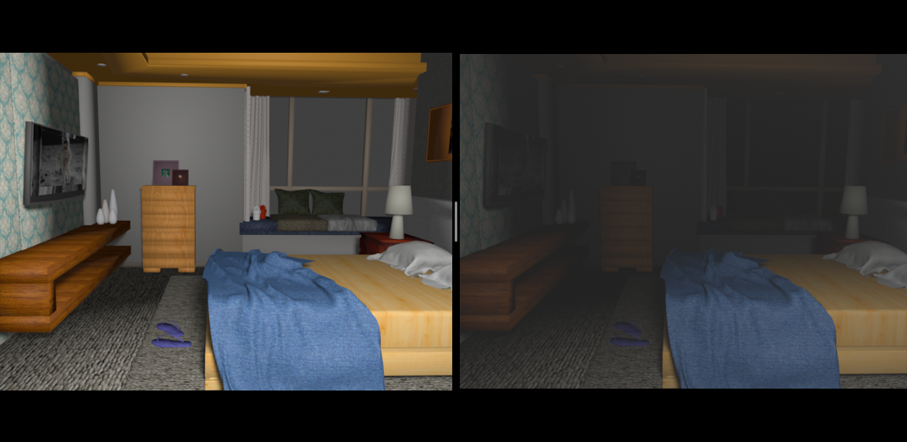

# 散乱画像生成モジュール

<p align="center">

</p>

## シーン画像生成
```
# 1000個の画像を生成する

$ bash createDataset.sh 1000
```

## 散乱画像生成
```
# '0505'=inputDirName, '0505'=outputDirName, 1000=処理する個数

$ bash add_scatter.sh 0505 0505 1000
```
