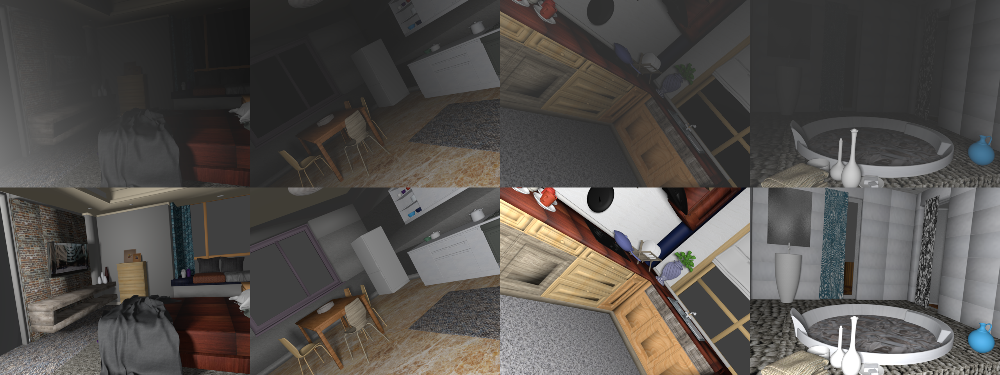

# HAZE dataset based on airlight integral model with SceneNet layouts

<p align="center">

</p>

## Environment
- Python 3.7.7
- blender 2.82

## Create haze-free images with indoor scenes
```
# create 1000 haze-free images

$ bash createDataset.sh 1000
```

## Create hazy images
```
# '0505'=inputDirName, '0505'=outputDirName, 1000=number of images to process

$ bash add_scatter.sh 0505 0505 1000
```
